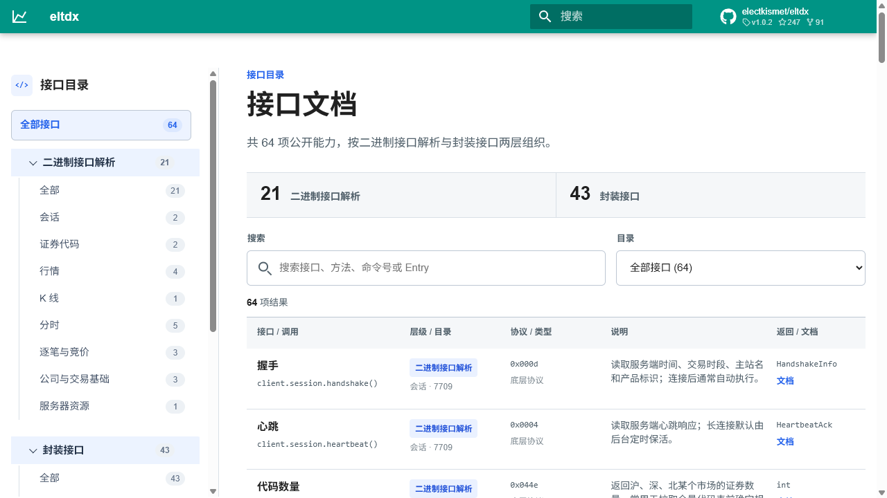

<h1 align="center">eltdx</h1>

<p align="center">
  <strong>极简的通达信在线行情协议 Python 客户端</strong>
</p>

<p align="center">
  <a href="https://electkismet.github.io/eltdx/"><strong>接口一览</strong></a>
  ·
  <a href="https://pypi.org/project/eltdx/">PyPI</a>
</p>

<p align="center">
  <a href="https://github.com/electkismet/eltdx/actions/workflows/ci.yml"></a>
  <a href="https://pypi.org/project/eltdx/"></a>
  <a href="https://electkismet.github.io/eltdx/"></a>
  
  <a href="./LICENSE"></a>
</p>

<a href="https://electkismet.github.io/eltdx/">
  
</a>

<p align="center">
  <a href="https://api.astlane.com/">
    
  </a>
</p>

> 推荐关注新项目 [AxData](https://github.com/electkismet/AxData)：AxData 基于 eltdx 迭代开发，是后续主要维护的开源量化数据库框架。除通达信体系外，AxData 还通过插件机制整理接入交易所、巨潮、腾讯财经、新浪财经、东方财富、财联社、开盘红等公开源接口，并扩展了自由流通市值、开盘换手、开盘量比、开盘抢筹、竞价昨比、连板天梯、题材强度等更适合本地量化研究和短线数据分析的指标能力。

通达信在线行情协议 Python 库。可以拿 A 股的行情、分时、成交明细、K 线、竞价、公司信息、题材信息等信息，支持 MCP 工具。

1. 本项目仅以个人学习、协议研究和非商业研究为目的进行开发。
2. 本项目基于互联网公开信息搜集开发。
3. 项目本身、衍生产品及通过本项目获取的数据禁止用于任何商业行为、付费服务、生产服务、转售或其他营利用途，产生的任何数据、损失或法律责任由使用者自负。
4. 对第三方服务器或服务的访问，用户需自行遵守相关法律法规及服务协议。
5. 请勿将本项目用于侵犯他人权益、违反监管规定或滥用第三方服务的行为。

感谢 [injoyai/tdx](https://github.com/injoyai/tdx) 及 [rainx/pytdx](https://github.com/rainx/pytdx) 的启发。

## eltdx 功能简介

| 类型     | 能力                                          | 入口                                 |
| ------ | ------------------------------------------- | ---------------------------------- |
| 行情基础   | 代码表、代码数量、批量行情查询/推送、分类行情                     | `client.codes`、`client.quotes`     |
| 图表数据   | K 线、当日分时、历史分时、近期分时、分时副图、小走势图                | `client.bars`、`client.minutes`     |
| 成交数据   | 当日成交明细、历史成交明细、集合竞价明细、09:25 竞价成交快照           | `client.trades`、`client.auctions`  |
| 公司基础   | 股本变迁、除权除息、财务基础信息、特殊品种涨跌停限制                  | `client.corporate`、`client.limits` |
| F10 资料 | 公司概况、热点题材、公告、新闻、研报、财务报表、估值、主营构成             | `client.f10` 或 `F10Client`         |
| 常用场景   | 股票信息汇总、个股概念板块、概念板块成分股、竞价数据、批量行情表、复权/不复权 K 线 | `client.helpers`                   |
| 工具能力   | 连接池、主站测速、自动心跳、低频数据缓存、JSON 序列化、交易日工具、MCP 工具服务 | `TdxClient`、`WorkdayService`、`eltdx-mcp` |

完整接口目录见 [GitHub Pages](https://electkismet.github.io/eltdx/)。调用方法和返回字段看 [METHOD_REFERENCE.md](docs/METHOD_REFERENCE.md)，常用问题入口看 [docs/helpers/README.md](docs/helpers/README.md)，完整 API 看 [API_REFERENCE.md](docs/API_REFERENCE.md)，字段总表看 [FIELD_REFERENCE.md](docs/FIELD_REFERENCE.md)，F10 资料看 [F10_7615.md](docs/F10_7615.md)，MCP 工具看 [MCP.md](docs/MCP.md)。

## 安装

```bash
pip install eltdx
```

如果需要启动 MCP stdio 工具服务，安装可选依赖：

```bash
pip install "eltdx[mcp]"
```

源码目录安装：

```bash
python -m venv .venv
.\.venv\Scripts\Activate.ps1
python -m pip install -U pip
pip install -e .
```

源码开发时建议始终先安装到当前虚拟环境；否则本机如果已有旧版 `eltdx`，`python -m eltdx...` 可能导入 site-packages 里的旧包。

安装后可以先看命令帮助：

```bash
eltdx-smoke --help
eltdx-f10-smoke --help
```

MCP 工具服务启动后会占用当前终端作为 stdio 服务：

```bash
eltdx-mcp
```

源码开发自测：

```bash
python -m pytest
```

源码仓库里的 `scripts/` 目录用于开发和排查；通过 `pip install eltdx` 安装后，优先使用上面的命令行入口。

## 快速开始

查行情走 `TdxClient`

```python
from eltdx import TdxClient

with TdxClient(timeout=3) as client:
    quote = client.get_quote(["sz000001", "sh600000"])
    bars = client.get_kline("day", "sz000001", count=30)
    minute = client.get_minute("sz000001")
    ticks = client.get_history_trade_day("sz000001", "2026-05-20")

print(quote[0])
print(bars.bars[-1])
```

查 F10 / 资料数据走 `client.f10`

```python
from eltdx import TdxClient

client = TdxClient(timeout=3)
profile = client.f10.company_profile("000034")
topics = client.f10.hot_topics("000034")
notices = client.f10.announcements("000034")

print(profile.rows[0])
print(topics.rows[:3])
print(notices.rows[:3])
```

如果只查 F10，也可以直接用轻量 HTTP 客户端：

```python
from eltdx import F10Client

f10 = F10Client(timeout=3)
print(f10.company_profile("000034").rows[0])
```

## 行情接口

| 功能           | 调用方法                                                       | 底层接口                                                                                        | 返回内容 / 用途                                                      | 文档                                    |
| ------------ | ---------------------------------------------------------- | ------------------------------------------------------------------------------------------- | -------------------------------------------------------------- | ------------------------------------- |
| 握手           | `client.session.handshake()`                               | [`0x000d`](docs/COMMANDS_7709.md#cmd-0x000d)                                                | 返回服务端日期时间、交易时段、主站名、产品标识；通常连接后自动使用                              | [文档](docs/methods/7709-握手.md)         |
| 心跳           | `client.session.heartbeat()`                               | [`0x0004`](docs/COMMANDS_7709.md#cmd-0x0004)                                                | 返回服务端心跳响应；长连接默认后台 30 秒保活，也可手动调用                                | [文档](docs/methods/7709-心跳.md)         |
| 代码数量         | `client.codes.count("sz")` / `get_count()`                 | [`0x044e`](docs/COMMANDS_7709.md#cmd-0x044e)                                                | 返回沪、深、北某个市场的证券数量；常用于全量拉代码表前确定规模                                | [文档](docs/methods/7709-代码数量.md)       |
| 代码表          | `client.codes.list()` / `get_codes_all()`                  | [`0x044d`](docs/COMMANDS_7709.md#cmd-0x044d)                                                | 返回代码、名称、市场、价格精度、昨收、A 股 / ETF / 指数等本地分类                         | [文档](docs/methods/7709-代码表.md)        |
| 批量快照         | `client.quotes.get_snapshots()` / `get_quote()`            | [`0x054c`](docs/COMMANDS_7709.md#cmd-0x054c) + [`0x0547`](docs/COMMANDS_7709.md#cmd-0x0547) | 按代码列表返回现价、涨跌幅、成交量额、内外盘和盘口；`get_quote()` 补齐五档盘口                   | [文档](docs/methods/7709-批量快照.md)       |
| 旧版批量行情       | `client.quotes.legacy()` / `get_legacy_quotes()`            | [`0x053e`](docs/COMMANDS_7709.md#cmd-0x053e)                                                | 按代码列表返回旧版行情、五档盘口和协议状态原始字段；便捷入口自动按 80 个代码拆批                    | [文档](docs/methods/7709-旧版批量行情.md)     |
| 五档盘口         | `client.get_quote_depth()` / `client.quotes.get_depth()`   | [`0x0547`](docs/COMMANDS_7709.md#cmd-0x0547)                                                | 用刷新接口按代码列表直接返回买一到买五 / 卖一到卖五                                         | [文档](docs/methods/7709-增量刷新推送队列.md) |
| 分类行情         | `client.quotes.list_by_category()`                         | [`0x054b`](docs/COMMANDS_7709.md#cmd-0x054b)                                                | 按市场或板块分页返回行情列表；可按涨幅、价格、成交额等服务端排序                               | [文档](docs/methods/7709-分类行情.md)       |
| 增量刷新 / 推送队列  | `client.quotes.refresh()` / `poll_push()`                  | [`0x0547`](docs/COMMANDS_7709.md#cmd-0x0547)                                                | 返回关注代码的增量行情；未配对推送帧进入 push queue 供调用方读取                         | [文档](docs/methods/7709-增量刷新推送队列.md)   |
| K 线 / 周期线    | `client.bars.get()` / `get_kline()`                        | [`0x052d`](docs/COMMANDS_7709.md#cmd-0x052d)                                                | 返回 OHLC、成交量额、前收等 K 线；支持 1/5/15/30/60 分钟、日、周、月、季、年线和服务端复权/不复权参数 | [文档](docs/methods/7709-K线周期线.md)      |
| 全量 K 线分页     | `client.bars.all()` / `get_kline_all()`                    | [`0x052d`](docs/COMMANDS_7709.md#cmd-0x052d)                                                | 自动按页拉取 K 线并合并；适合补历史日线或分钟线数据                                    | [文档](docs/methods/7709-全量K线分页.md)     |
| 当日分时         | `client.minutes.today()` / `get_minute()`                  | [`0x0537`](docs/COMMANDS_7709.md#cmd-0x0537)                                                | 返回当前交易日每分钟价格、成交量、均价等分时序列                                       | [文档](docs/methods/7709-当日分时.md)       |
| 指定日期历史分时     | `client.minutes.history()` / `get_history_minute()`        | [`0x0fb4`](docs/COMMANDS_7709.md#cmd-0x0fb4)                                                | 按日期返回某天的分时价格和分钟成交量，适合补单日历史分时                                   | [文档](docs/methods/7709-指定日期历史分时.md)   |
| 近期历史分时       | `client.minutes.recent()`                                  | [`0x0feb`](docs/COMMANDS_7709.md#cmd-0x0feb)                                                | 返回服务端近期窗口内的历史分时；适合查较近交易日的分钟走势                                  | [文档](docs/methods/7709-近期历史分时.md)     |
| 分时副图         | `client.minutes.aux()`                                     | [`0x051b`](docs/COMMANDS_7709.md#cmd-0x051b)                                                | 返回分时页下方副图数据，例如买卖力道、成交对比等序列                                     | [文档](docs/methods/7709-分时副图.md)       |
| 小走势图         | `client.minutes.sparkline()`                               | [`0x0fd1`](docs/COMMANDS_7709.md#cmd-0x0fd1)                                                | 返回单标的小型价格走势序列，适合列表页或概览页的小图                                     | [文档](docs/methods/7709-小走势图.md)       |
| 当日成交明细       | `client.trades.today()` / `get_trades()`                   | [`0x0fc5`](docs/COMMANDS_7709.md#cmd-0x0fc5)                                                | 返回当前交易日一条条成交记录：时间、价格、成交量、方向、状态等                                | [文档](docs/methods/7709-当日成交明细.md)     |
| 历史成交明细       | `client.trades.history()` / `get_history_trade_day()`      | [`0x0fc6`](docs/COMMANDS_7709.md#cmd-0x0fc6)                                                | 返回指定日期一条条成交记录；支持分页拉全，包含委托笔数等扩展字段                               | [文档](docs/methods/7709-历史成交明细.md)     |
| 集合竞价明细       | `client.auctions.series()` / `get_call_auction()`          | [`0x056a`](docs/COMMANDS_7709.md#cmd-0x056a)                                                | 返回当前交易日集合竞价阶段的价格、虚拟成交量、买卖盘等明细记录                                | [文档](docs/methods/7709-集合竞价明细.md)     |
| 09:25 竞价成交快照 | `client.get_auction_0925()`                                | [`0x0fc6`](docs/COMMANDS_7709.md#cmd-0x0fc6)                                                | 从历史成交明细里扫描 09:25 最终成交，返回价格、成交量、成交额和方向状态                        | [文档](docs/methods/7709-0925竞价成交快照.md) |
| 股本变迁 / GBBQ  | `client.corporate.capital_changes()` / `get_gbbq()`        | [`0x000f`](docs/COMMANDS_7709.md#cmd-0x000f)                                                | 返回除权除息、股本变化、增发、回购等股本事件记录                                       | [文档](docs/methods/7709-股本变迁GBBQ.md)   |
| 除权除息整理       | `client.get_xdxr()`                                        | [`0x000f`](docs/COMMANDS_7709.md#cmd-0x000f)                                                | 从股本变迁里筛出除权除息事件，整理分红、送转、配股等字段                                   | [文档](docs/methods/7709-除权除息整理.md)     |
| 指定日期股本       | `client.get_equity()`                                      | [`0x000f`](docs/COMMANDS_7709.md#cmd-0x000f)                                                | 从股本变化记录中取某日期之前最近一次流通股本和总股本                                     | [文档](docs/methods/7709-指定日期股本.md)     |
| 换手率          | `client.get_turnover()`                                    | [`0x000f`](docs/COMMANDS_7709.md#cmd-0x000f)                                                | 用成交量和流通股本本地计算换手率；服务器不直接返回这个结果                                  | [文档](docs/methods/7709-换手率.md)        |
| 本地复权因子       | `client.get_factors()`                                     | [`0x052d`](docs/COMMANDS_7709.md#cmd-0x052d) + [`0x000f`](docs/COMMANDS_7709.md#cmd-0x000f) | 用不复权日 K 和除权除息记录计算本地前复权 / 后复权因子                                 | [文档](docs/methods/7709-本地复权因子.md)     |
| 财务基础信息       | `client.corporate.finance_batch()` / `get_finance_batch()` | [`0x0010`](docs/COMMANDS_7709.md#cmd-0x0010)                                                | 批量返回流通股本、总股本、EPS、资产、负债、收入、利润等基础财务字段                            | [文档](docs/methods/7709-财务基础信息.md)     |
| 特殊品种涨跌停限制    | `client.limits.special()`                                  | [`0x0452`](docs/COMMANDS_7709.md#cmd-0x0452)                                                | 返回特殊品种涨跌停限制表；需要按表扫描后本地索引到具体代码                                  | [文档](docs/methods/7709-特殊品种涨跌停限制.md)  |
| 服务器文件读取      | `client.resources.read()` / `download_file()` / `read_stats()` | [`0x06b9`](docs/COMMANDS_7709.md#cmd-0x06b9)                                              | 读取文件块或下载整文件，并可解析 `zhb.zip` 中的 `tdxstat.cfg` / `tdxstat2.cfg`              | [文档](docs/methods/7709-服务器文件读取.md)    |

`7709` 命令和 API 对照见 [COMMANDS_7709.md](docs/COMMANDS_7709.md)，完整调用参数见 [API_REFERENCE.md](docs/API_REFERENCE.md)。

### K 线周期和复权

K 线是最常用的接口之一，周期和复权参数可以直接这样传：

```python
client.bars.get("sz000001", period="day", count=200)
client.bars.get("sz000001", period="week", count=100)
client.bars.get("sz000001", period="year", count=20)
client.bars.get("sz000001", period="1m", count=240)
client.bars.get("sz000001", period="day", adjust="qfq", count=200)
client.bars.get("sz000001", period="day", adjust="fixed_qfq", anchor_date="2024-06-03")
```

| 参数            | 可选值                                       | 含义                                |
| ------------- | ----------------------------------------- | --------------------------------- |
| `period`      | `1m`, `5m`, `15m`, `30m`, `60m`           | 分钟 K 线                            |
| `period`      | `day`, `week`, `month`, `quarter`, `year` | 日 K、周 K、月 K、季 K、年 K               |
| `period`      | `10m`, `2d`, `5s` 这类形式                    | 协议层支持自定义分钟、N 日、N 秒周期；实际返回以服务端支持为准 |
| `adjust`      | `None` / `none`                           | 不复权                               |
| `adjust`      | `qfq` / `front`                           | 前复权                               |
| `adjust`      | `hfq` / `back`                            | 后复权                               |
| `adjust`      | `fixed_qfq` / `fixed_hfq`                 | 定点前复权 / 定点后复权，需要配合 `anchor_date`  |
| `anchor_date` | `YYYY-MM-DD`、`YYYYMMDD`、`date`            | 定点复权基准日期，仅定点复权时需要                 |

## F10 资料接口

| 功能           | 调用方法                                                    | 底层 Entry                                                                              | 返回内容 / 用途                                    | 文档                                  |
| ------------ | ------------------------------------------------------- | ------------------------------------------------------------------------------------- | -------------------------------------------- | ----------------------------------- |
| 通用 Entry 调用  | `client.f10.call(entry, body/params)`                   | [`7615/TQLEX`](docs/F10_7615.md#tqlex-gateway)                                        | 直接 POST 任意 TQLEX Entry；适合验证资料函数或补充调用特殊 Entry | [文档](docs/methods/F10-通用Entry调用.md) |
| 股票基础信息       | `client.f10.stock_info()`                               | [`CWServ.tdxf10_gg_comreq`](docs/F10_7615.md#entry-cwserv-tdxf10-gg-comreq)           | 返回股票名称、代码、市场；也用于主营构成报告期、题材 ID 等辅助查询          | [文档](docs/methods/F10-股票基础信息.md)    |
| 公司概况         | `client.f10.company_profile()`                          | [`CWServ.tdxf10_gg_gsgk`](docs/F10_7615.md#entry-cwserv-tdxf10-gg-gsgk)               | 返回发行上市信息，如上市日期、发行方式、发行价、募资额、承销商等             | [文档](docs/methods/F10-公司概况.md)      |
| 主营构成         | `client.f10.business_composition()`                     | [`CWServ.tdxf10_gg_jyfx`](docs/F10_7615.md#entry-cwserv-tdxf10-gg-jyfx)               | 返回主营收入、成本、毛利、收入占比、毛利率；不传报告期时自动取最新期           | [文档](docs/methods/F10-主营构成.md)      |
| 股东增减持        | `client.f10.shareholder_change_plans()`                 | [`CWServ.tdxf10_gg_gdyj`](docs/F10_7615.md#entry-cwserv-tdxf10-gg-gdyj)               | 返回公告日、股东名称、变动方向、拟变动数量 / 比例、计划起止日期等           | [文档](docs/methods/F10-股东增减持.md)     |
| 分红融资         | `client.f10.dividend_financing()`                       | [`CWServ.tdxf10_gg_fhrz`](docs/F10_7615.md#entry-cwserv-tdxf10-gg-fhrz)               | 返回分红方案、股权登记日、除权派息日、股息率、股利支付率、融资相关数据          | [文档](docs/methods/F10-分红融资.md)      |
| 增发获配         | `client.f10.allotment_dates()` / `allotment_details()`  | [`CWServ.tdxf10_gg_fhrz_zfhpmx`](docs/F10_7615.md#entry-cwserv-tdxf10-gg-fhrz-zfhpmx) | 先取增发日期，再按日期取获配机构、获配数量、获配金额、锁定期等明细            | [文档](docs/methods/F10-增发获配.md)      |
| 财务报表         | `client.f10.finance_report()`                           | [`CWServ.tdxf10_gg_cwfx`](docs/F10_7615.md#entry-cwserv-tdxf10-gg-cwfx)               | 返回多期财务报表；默认资产负债表，含货币资金、资产总计、负债合计、股东权益等       | [文档](docs/methods/F10-财务报表.md)      |
| 财务诊断         | `client.f10.finance_diagnosis()`                        | [`CWServ.tdxf10_gg_cwzd`](docs/F10_7615.md#entry-cwserv-tdxf10-gg-cwzd)               | 返回营运、盈利、成长、现金流、资产质量、Z 值预警、财务总评分等诊断项          | [文档](docs/methods/F10-财务诊断.md)      |
| 个股总评         | `client.f10.stock_score()`                              | [`CWServ.tdxf10_gg_ggzp`](docs/F10_7615.md#entry-cwserv-tdxf10-gg-ggzp)               | 返回综合评分、行业排名、市场排名、资金面 / 基本面 / 消息面 / 主题面评分     | [文档](docs/methods/F10-个股总评.md)      |
| 盈利预测         | `client.f10.profit_forecast()`                          | [`CWServ.tdxf10_gg_ybpj`](docs/F10_7615.md#entry-cwserv-tdxf10-gg-ybpj)               | 返回未来三年 EPS、归母净利润、营业收入预测、历史实际值和预测机构数量         | [文档](docs/methods/F10-盈利预测.md)      |
| 题材概念行情       | `client.f10.theme_market()`                             | [`HQServ.hq_nlp_tcihq`](docs/F10_7615.md#entry-hqserv-hq-nlp-tcihq)                   | 返回相关板块、板块成分股、主力控盘比例、主力资金走势、区间统计等             | [文档](docs/methods/F10-题材概念行情.md)    |
| 估值市场数据       | `client.f10.valuation()`                                | [`HQServ.hq_nlp_gpsj`](docs/F10_7615.md#entry-hqserv-hq-nlp-gpsj)                     | 返回 PE(TTM)、PB(MRQ)、市销率、市现率、估值百分位、流通市值、总市值等   | [文档](docs/methods/F10-估值市场数据.md)    |
| 市场 / 行业排名    | `client.f10.ranking_detail()`                           | [`CWServ.tdxf10_gg_zxts_rqpm`](docs/F10_7615.md#entry-cwserv-tdxf10-gg-zxts-rqpm)     | 返回当前股票排名、排名变化，以及同组股票代码、简称、市场和更新时间            | [文档](docs/methods/F10-市场行业排名.md)    |
| 资本运作治理       | `client.f10.governance()`                               | [`CWServ.tdxf10_gg_zbyz`](docs/F10_7615.md#entry-cwserv-tdxf10-gg-zbyz)               | 返回担保明细、违规处理、处罚公布日、案情进展、处罚决定、详情记录 ID 等        | [文档](docs/methods/F10-资本运作治理.md)    |
| 热点题材         | `client.f10.hot_topics()`                               | [`CWServ.tdxf10_gg_rdtc`](docs/F10_7615.md#entry-cwserv-tdxf10-gg-rdtc)               | 返回题材名称、关联度、入选日期、入选原因、事件名称和事件详情 ID            | [文档](docs/methods/F10-热点题材.md)      |
| 题材内对比        | `client.f10.topic_compare()` / `topic_compare_first()`  | [`CWServ.tdxf10_gg_rdtc_gndb`](docs/F10_7615.md#entry-cwserv-tdxf10-gg-rdtc-gndb)     | 返回题材内股票财务 / 市值 / 涨幅排名，可用于比较同题材个股             | [文档](docs/methods/F10-题材内对比.md)     |
| 公司资讯 / 研报    | `client.f10.company_news()`                             | [`CWServ.tdxf10_gg_gszx`](docs/F10_7615.md#entry-cwserv-tdxf10-gg-gszx)               | 返回研报标题、评级类别、研究员、撰写日期、研报地址，也可查监管措施            | [文档](docs/methods/F10-公司资讯研报.md)    |
| 沪深股通持仓       | `client.f10.northbound_holding()`                       | [`CWServ.tdxf10_gg_zlcc`](docs/F10_7615.md#entry-cwserv-tdxf10-gg-zlcc)               | 返回沪股通 / 深股通持股比例、持股数量、变动股数、收盘价等序列             | [文档](docs/methods/F10-沪深股通持仓.md)    |
| 详情正文         | `client.f10.detail()`                                   | [`CWServ.tdxf10_gg_idreq`](docs/F10_7615.md#entry-cwserv-tdxf10-gg-idreq)             | 按记录 ID 返回正文标题和正文内容；常接热点题材事件、违规处理等详情          | [文档](docs/methods/F10-详情正文.md)      |
| 新闻 / 公告 / 路演 | `client.f10.news()` / `announcements()` / `roadshows()` | [`CWSearch.tzx_rcache`](docs/F10_7615.md#entry-cwsearch-tzx-rcache)                   | 返回新闻、公告、路演列表；含标题、日期、来源、公告类型、PDF 地址等          | [文档](docs/methods/F10-新闻公告路演.md)    |

F10 返回统一是 `F10Response`。常用结果在 `response.rows`，多表结果在 `response.tables`。完整说明见 [F10_7615.md](docs/F10_7615.md)。

## 连接和缓存

默认 `TdxClient()` 使用真实 `7709` 行情主站；不传 `host` / `hosts` 时，会读取包内 `tdx_server.json`。

```python
from eltdx import TdxClient

with TdxClient(host="116.205.183.150:7709", timeout=3) as client:
    print(client.get_quote("sz000001"))

with TdxClient.from_hosts(pool_size=2, probe_hosts=True, timeout=3) as client:
    print(client.codes.count("sz"))
```

真实 socket 连接默认每 30 秒自动心跳保活。关闭后台心跳：

```python
client = TdxClient(heartbeat_interval=None)
```

低频数据会缓存到内存里，包括代码数量、全量代码表、股本变迁和财务基础信息。实时行情、分时、成交明细、K 线默认不缓存。

```python
client.get_codes_all("sz", refresh=True)
client.get_gbbq("sz000001", refresh=True)
client.clear_cache()
```

## 调试和导出

部分接口支持 `include_raw=True`，用于保留原始 payload 或单条记录 hex，方便排查字段解析问题。

```python
gbbq = client.get_gbbq("sz000001", include_raw=True)
bars = client.get_kline("day", "sz000001", include_raw=True)
ticks = client.get_history_trade("sz000001", "2026-05-20", include_raw=True)
```

返回模型可以直接转 JSON：

```python
from eltdx import to_json, to_jsonable

data = to_jsonable(client.get_quote("sz000001"))
text = to_json(data, indent=2)
```

真实环境 smoke：

```bash
eltdx-smoke --timeout 6 --no-heartbeat
eltdx-f10-smoke --code 000034 --timeout 8
```

源码仓库可运行更多开发脚本，例如批量导出某段日期的 09:25 竞价成交快照：

```bash
python scripts/smoke/export_auction_925_daily.py --code sz000001 --start 2026-04-01 --end 2026-04-30
```

## 文档

使用文档现在按层级拆开看：

| 层级           | 看哪里                                                  | 适合解决什么问题                   |
| ------------ | ---------------------------------------------------- | -------------------------- |
| 快速总览         | 本 README                                             | 这个库能查什么、用哪个方法、底层接口是什么      |
| 常用问题         | [docs/helpers/README.md](docs/helpers/README.md)     | 按问题进入对应调用说明             |
| 版本更新         | [docs/UPDATE_FROM_0_5_1.md](docs/UPDATE_FROM_0_5_1.md) | 从 `v0.5.1` 到 `v1.0.0` 的更新说明 |
| 方法字段手册       | [docs/METHOD_REFERENCE.md](docs/METHOD_REFERENCE.md) | 每个调用方法怎么传参、返回哪些解析字段        |
| 具体调用         | [docs/API_REFERENCE.md](docs/API_REFERENCE.md)       | 每组 API 怎么传参数、返回什么、有哪些注意点   |
| 7709 接口对照    | [docs/COMMANDS_7709.md](docs/COMMANDS_7709.md)       | 21 个二进制命令分别对应哪个业务 API      |
| F10 Entry 对照 | [docs/F10_7615.md](docs/F10_7615.md)                 | 7615/TQLEX 每个资料 Entry 怎么调用 |
| 字段说明         | [docs/FIELD_REFERENCE.md](docs/FIELD_REFERENCE.md)   | 返回模型里的字段中文含义               |

| 文档                                                       | 内容                     |
| -------------------------------------------------------- | ---------------------- |
| [docs/README.md](docs/README.md)                         | 文档入口                   |
| [docs/PRODUCT.md](docs/PRODUCT.md)                       | 产品定位和能力总览              |
| [docs/UPDATE_FROM_0_5_1.md](docs/UPDATE_FROM_0_5_1.md)   | 从 `v0.5.1` 到 `v1.0.0` 的更新说明 |
| [docs/helpers/README.md](docs/helpers/README.md)         | 常用问题入口                |
| [docs/METHOD_REFERENCE.md](docs/METHOD_REFERENCE.md)     | 调用方法、参数和解析字段           |
| [docs/methods/README.md](docs/methods/README.md)         | 每个调用方法的单页说明            |
| [docs/API_REFERENCE.md](docs/API_REFERENCE.md)           | API 调用说明               |
| [docs/EXAMPLES.md](docs/EXAMPLES.md)                     | 常见复制即用示例               |
| [docs/FIELD_REFERENCE.md](docs/FIELD_REFERENCE.md)       | 返回字段中文含义               |
| [docs/F10_7615.md](docs/F10_7615.md)                     | 7615 F10 / TQLEX 调用说明  |
| [docs/MCP.md](docs/MCP.md)                               | MCP 工具说明               |
| [docs/COMMANDS_7709.md](docs/COMMANDS_7709.md)           | 21 个 `7709` 命令和 API 映射 |
| [docs/DEBUG_GUIDE.md](docs/DEBUG_GUIDE.md)               | 连接、主站和协议排查             |
| [docs/ARCHITECTURE.md](docs/ARCHITECTURE.md)             | 项目分层和实现结构              |
| [docs/FIELD_MIGRATION.md](docs/FIELD_MIGRATION.md)       | 历史字段到当前字段的对照           |
| [docs/MIGRATION_FROM_OLD.md](docs/MIGRATION_FROM_OLD.md) | 历史代码整理说明               |
| [docs/ROADMAP.md](docs/ROADMAP.md)                       | 实现路线                   |
| [scripts/README.md](scripts/README.md)                   | smoke / live 脚本说明      |

## 常用问题

- [想拿某个或某些股票的表头信息怎么办？](docs/helpers/股票信息汇总.md)
- [想查询某个股票都有哪些概念板块怎么办？](docs/helpers/个股概念板块.md)
- [想查询某个概念板块都有哪些股票怎么办？](docs/helpers/概念板块成分股.md)
- [想拿集合竞价数据怎么办？](docs/helpers/竞价数据.md)
- [想给一批股票整理行情表怎么办？](docs/helpers/批量行情表.md)
- [想拿复权或不复权 K 线怎么办？](docs/helpers/复权K线.md)

常用组合调用示例：

```python
from eltdx import TdxClient

with TdxClient(timeout=3) as client:
    table = client.helpers.stock_profile_table(["sz000001", "sh600000"])
    topics = client.helpers.stock_topics("000034")
    stocks = client.helpers.topic_stocks("000034", topic_name="存储芯片")
    auction = client.helpers.auction_data("sz000001", "2026-05-20")

print(table.rows[0])
print(topics.topics[:3])
print(stocks.rows[:10])
print(auction.open_price, auction.open_change_pct, auction.open_amount)
```

完整入口见 [docs/helpers/README.md](docs/helpers/README.md)。

## 联系

- QQ 群：[点击链接加入群聊](https://qm.qq.com/q/zAjpZsvfzy)

- 邮箱：[dapaoxixixi@163.com](mailto:dapaoxixixi@163.com)

## 许可证

本项目仅允许个人学习、协议研究和非商业研究使用，禁止一切商业使用和滥用。详细条款见 [LICENSE](LICENSE)。
